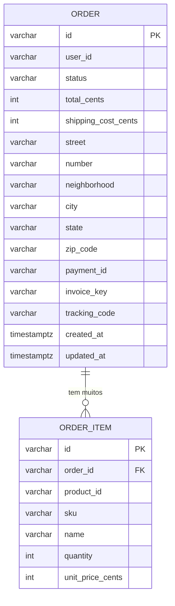

# Data Model — ecom-order-service

> Documento vivo do modelo de dados. Atualizado sempre que uma entidade for criada, alterada ou removida.
> **Ultima atualizacao:** 2026-06-16

---

## Indice

- [Visao Geral](#visao-geral)
- [Diagrama ER](#diagrama-er)
- [Entidades](#entidades)
- [Enums e Dominio de Valores](#enums-e-dominio-de-valores)
- [Indices e Performance](#indices-e-performance)
- [Classificacao de Privacidade](#classificacao-de-privacidade)
- [Decisoes de Modelagem](#decisoes-de-modelagem)

---

## Visao Geral

O modelo de dados do Order Service possui 2 entidades principais: `Order` (pedido) e `OrderItem` (itens do pedido). A entidade central e `Order`, que armazena dados do cliente, valores financeiros, referencias a servicos externos (payment_id, invoice_key, tracking_code) e o status do ciclo de vida. `OrderItem` representa cada produto dentro do pedido com precos congelados no momento da compra.

**Banco de dados:** PostgreSQL 15
**ORM / acesso:** Spring Data JPA / Hibernate 6
**Extensoes relevantes:** pgcrypto (para UUID se necessario), uuid-ossp

---

## Diagrama ER

---

## Entidades

### Order

> Entidade central que representa o pedido do cliente. Contem dados de endereco, valores financeiros e referencias para os servicos downstream.

**Tabela:** `orders`
**Servico responsavel:** ecom-order-service

| Campo | Tipo SQL | Nullable | Default | Descricao |
|-------|----------|----------|---------|-----------|
| `id` | VARCHAR(36) | Nao | UUID aleatorio | Identificador unico do pedido (gerado via Java UUID) |
| `user_id` | VARCHAR(36) | Nao | — | ID do usuario no servico de usuarios |
| `status` | VARCHAR(20) | Nao | 'PENDING' | Status atual do pedido. Ver enum OrderStatus |
| `total_cents` | INTEGER | Nao | — | Valor total do pedido em centavos (itens + frete) |
| `shipping_cost_cents` | INTEGER | Nao | — | Custo do frete em centavos |
| `street` | VARCHAR(255) | Sim | NULL | Logradouro do endereco de entrega |
| `number` | VARCHAR(20) | Sim | NULL | Numero do endereco |
| `neighborhood` | VARCHAR(255) | Sim | NULL | Bairro |
| `city` | VARCHAR(255) | Sim | NULL | Cidade |
| `state` | VARCHAR(2) | Sim | NULL | Estado (UF, 2 caracteres) |
| `zip_code` | VARCHAR(9) | Sim | NULL | CEP |
| `payment_id` | VARCHAR(100) | Sim | NULL | ID do pagamento no servico de pagamentos |
| `invoice_key` | VARCHAR(44) | Sim | NULL | Chave de acesso da nota fiscal (44 caracteres) |
| `tracking_code` | VARCHAR(100) | Sim | NULL | Codigo de rastreamento do frete |
| `created_at` | TIMESTAMP | Nao | NOW() | Data de criacao do pedido |
| `updated_at` | TIMESTAMP | Nao | NOW() | Data da ultima atualizacao |

**Constraints:**
- `PRIMARY KEY (id)`

**Relacionamentos:**
- Um `Order` tem muitos `OrderItem` via `order_items.order_id`

---

### OrderItem

> Representa um item/produto dentro de um pedido. Os precos e nomes sao congelados no momento da compra (snapshot).

**Tabela:** `order_items`
**Servico responsavel:** ecom-order-service

| Campo | Tipo SQL | Nullable | Default | Descricao |
|-------|----------|----------|---------|-----------|
| `id` | VARCHAR(36) | Nao | UUID aleatorio | Identificador unico do item |
| `order_id` | VARCHAR(36) | Nao | — | FK para o pedido (chave estrangeira) |
| `product_id` | VARCHAR(36) | Nao | — | ID do produto no catalogo |
| `sku` | VARCHAR(100) | Nao | — | SKU do produto no momento da compra |
| `name` | VARCHAR(255) | Nao | — | Nome do produto no momento da compra |
| `quantity` | INTEGER | Nao | — | Quantidade adquirida |
| `unit_price_cents` | INTEGER | Nao | — | Preco unitario em centavos no momento da compra |

**Constraints:**
- `PRIMARY KEY (id)`
- `FOREIGN KEY (order_id) REFERENCES orders(id) ON DELETE CASCADE`

**Relacionamentos:**
- Muitos `OrderItem` pertencem a um `Order` via `order_id`

---

## Enums e Dominio de Valores

### OrderStatus

Usado em: `orders.status`

| Valor | Significado |
|-------|-------------|
| `PENDING` | Pedido recebido, aguardando processamento |
| `CONFIRMED` | Pedido completamente processado (pago + nota emitida + codigo de rastreio gerado) |
| `PAID` | Pagamento confirmado (transicao interna durante a orquestracao) |
| `SHIPPING` | Pedido em transporte |
| `DELIVERED` | Pedido entregue ao cliente |
| `CANCELLED` | Pedido cancelado |

**Observacao:** Atualmente o fluxo de criacao transiciona de `PENDING` -> `PAID` -> `CONFIRMED` em sequencia. Os demais status (`SHIPPING`, `DELIVERED`, `CANCELLED`) estao definidos mas ainda nao possuem implementacao de transicao.

---

## Indices e Performance

| Indice | Tabela | Campos | Tipo | Motivo |
|--------|--------|--------|------|--------|
| `idx_orders_user_id` | `orders` | `user_id, created_at DESC` | BTREE | Consulta de pedidos por usuario com ordenacao temporal |
| `idx_order_items_order_id` | `order_items` | `order_id` | BTREE | FK lookup para carregar itens de um pedido |

---

## Classificacao de Privacidade

| Campo | Tabela | Classificacao | Justificativa |
|-------|--------|---------------|---------------|
| `street` | `orders` | Pessoal | Endereco do cliente |
| `number` | `orders` | Pessoal | Endereco do cliente |
| `neighborhood` | `orders` | Pessoal | Endereco do cliente |
| `city` | `orders` | Pessoal | Endereco do cliente |
| `state` | `orders` | Pessoal | Endereco do cliente |
| `zip_code` | `orders` | Pessoal | CEP — dado de localizacao |
| `user_id` | `orders` | Pessoal | Identificador do usuario |

**Regras gerais:**
- Campos marcados como **Critico** nunca saem do banco
- Campos marcados como **Sensivel** exigem consentimento explicito antes de qualquer processamento
- Campos marcados como **Pessoal** so sao retornados ao proprio usuario autenticado
- Campos marcados como **Publico derivado** podem aparecer em respostas de API

---

## Decisoes de Modelagem

### ADR-DM-001 — ID como String (UUID gerado via Java)

| Campo | Detalhe |
|-------|---------|
| **Status** | Aceita |
| **Data** | 2026-06-16 |
| **Contexto** | Hibernate 6 com PostgreSQL requer configuracao explicita para geracao de UUID binary(16). Optou-se por simplificar usando String UUID para evitar complexidade de configuracao e manter compatibilidade entre ambientes. |
| **Decisao** | Utilizar `String id` com geracao via `UUID.randomUUID().toString()` no construtor da entidade, em vez de `@GeneratedValue` com tipo UUID nativo do PostgreSQL. |
| **Alternativas consideradas** | `@GeneratedValue` com `UUID` nativo, `@GenericGenerator` com `uuid2` |
| **Consequencias** | Coluna VARCHAR(36) em vez de binary(16) — 36 bytes vs 16 bytes de storage. Indexacao ligeiramente menos eficiente, mas simplifica desenvolvimento e eliminacao de dependencia de extensoes do banco. |

### ADR-DM-002 — CASCADE delete em OrderItem

| Campo | Detalhe |
|-------|---------|
| **Status** | Aceita |
| **Data** | 2026-06-16 |
| **Contexto** | Itens de pedido nao fazem sentido sem o pedido pai. A exclusao de um Order implica na remocao de todos os seus itens. |
| **Decisao** | `@OneToMany(cascade = CascadeType.ALL, orphanRemoval = true)` no lado `Order` com `FOREIGN KEY (order_id) REFERENCES orders(id) ON DELETE CASCADE` no banco. |
| **Alternativas consideradas** | Exclusao manual via repository |
| **Consequencias** | Garante consistencia: quando um pedido e removido, todos os itens sao removidos automaticamente tanto na JPA quanto no banco. |
