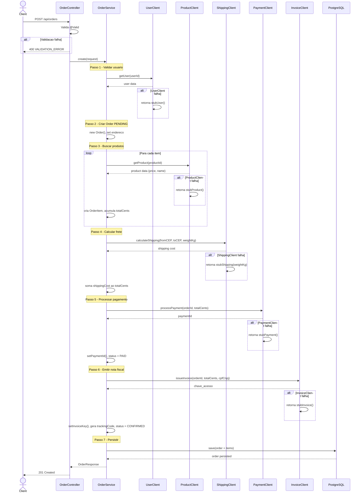
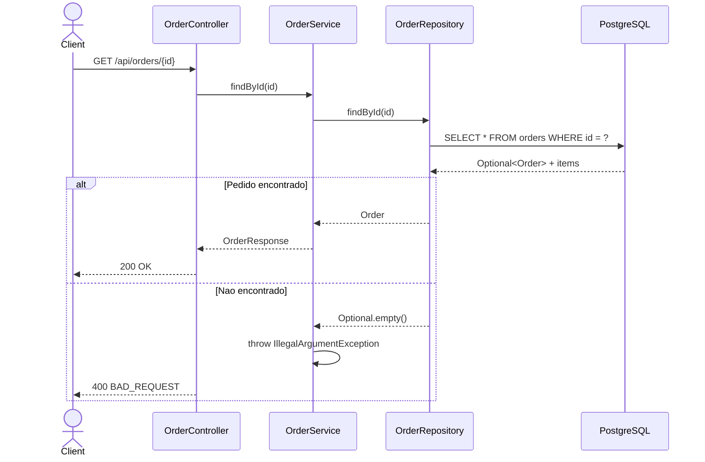

# System Feature Flows

> Registro historico e incremental dos fluxos internos de cada funcionalidade.
> Este documento cresce a cada nova feature implementada e **nunca tem secoes removidas**.

---

## Indice

- [Visao Geral da Arquitetura](#visao-geral-da-arquitetura)
- [Convencoes deste Documento](#convencoes-deste-documento)
- [Feature: Criação de Pedido (Orquestracao)](#feature-criacao-de-pedido-orquestracao)
- [Feature: Circuit Breaker nos Clientes HTTP](#feature-circuit-breaker-nos-clientes-http)
- [Feature: SAGA Compensatoria (Rollback)](#feature-saga-compensatoria-rollback)
- [Feature: Retry com Backoff nos Clientes HTTP](#feature-retry-com-backoff-nos-clientes-http)
- [Feature: Consulta de Pedido](#feature-consulta-de-pedido)

---

## Visao Geral da Arquitetura

**Padrao arquitetural:** SAGA Orchestrator. O `OrderService` centraliza a orquestracao chamando servicos downstream sequencialmente. Cada cliente HTTP encapsula a logica de fallback stub.

**Stack:** Java 21, Spring Boot 3.4, Spring Data JPA / Hibernate, PostgreSQL 15, RestTemplate

**Fluxo global de uma requisicao:**

```
HTTP Request
    └── OrderController (Presentation)
            └── OrderService (Application / Use Case)
                    ├── Order (Domain Entity)
                    ├── OrderRepository / OrderItem (Infra - JPA)
                    └── *Client (Infra - RestTemplate)
                              ├── UserClient → user-service:3007
                              ├── ProductClient → product-catalog:3001
                              ├── ShippingClient → shipping-service:3005
                              ├── PaymentClient → payment-service:3004
                              └── InvoiceClient → invoice-service:3006
```

**Camadas e responsabilidades:**

| Camada         | Responsabilidade                                                  |
|----------------|-------------------------------------------------------------------|
| `controller`   | Receber requisicoes, validar DTOs (@Valid), formatar resposta     |
| `service`      | Orquestrar o caso de uso, coordenar entidades e clients           |
| `model`        | Entidades JPA, enum OrderStatus                                   |
| `repository`   | Spring Data JpaRepository                                         |
| `client`       | RestTemplate + catch(Exception) com fallback stub                 |
| `config`       | ErrorResponse envelope, RequestIdFilter                           |
| `exception`    | @RestControllerAdvice com tratamento global de erros               |

---

## Convencoes deste Documento

- **Erros de dominio** sao lancados como `IllegalArgumentException` (ex: pedido nao encontrado)
- **Erros de integracao** sao capturados em cada Client e substituidos por dados stub (fallback silencioso)
- **Transacoes de banco** sao gerenciadas automaticamente pelo Spring Data JPA
- **DTOs** trafegam entre controller e service; Entidades JPA sao exclusivas do pacote `model`
- **Envelope de erro** padrao: `{ "data": null, "error": { "code": "...", "message": "..." }, "meta": { "requestId": "...", "timestamp": "..." } }`

---

---

# Feature: Criacao de Pedido (Orquestracao)

> **Versao:** 1.0.0
> **Implementada em:** 2026-06-16
> **Status:** Concluida

---

## Resumo

Endpoint que recebe os dados do pedido (usuario, itens, endereco) e orquestra 5 servicos downstream em sequencia para completar a transacao: valida usuario, consulta dados dos produtos no catalogo, calcula frete, processa pagamento e emite nota fiscal. Retorna o pedido completo com status CONFIRMED.

**Motivacao:** Centralizar a logica de coordenacao entre servicos em um unico orquestrador, eliminando a complexidade de coreografia entre microsservicos.
**Resultado:** Um unico POST /api/orders entrega um pedido completamente processado com pagamento, nota fiscal e codigo de rastreio.

---

## Fluxo Principal

### 1. Ponto de Entrada

- **Tipo:** HTTP REST
- **Arquivo:** `src/main/java/com/ecom/order/controller/OrderController.java:23-26`
- **Rota/Evento:** `POST /api/orders`
- **Autenticacao:** Nao implementada (publica)

O `OrderController` recebe o JSON validado e delega ao `OrderService.create()`. Em caso de dados invalidos, retorna 400 imediatamente sem chamar o servico.

---

### 2. Validacao de Entrada

- **Arquivo:** `src/main/java/com/ecom/order/dto/CreateOrderRequest.java`
- **Biblioteca:** Jakarta Validation (`spring-boot-starter-validation`)

| Campo | Tipo | Obrigatorio | Regra de validacao |
|-------|------|-------------|---------------------|
| `userId` | String | Sim | @NotBlank |
| `items` | List<ItemRequest> | Sim | @NotEmpty, @Valid |
| `items[].productId` | String | Sim | @NotBlank |
| `items[].sku` | String | Sim | @NotBlank |
| `items[].quantity` | int | Nao (default 1) | — |
| `street` | String | Sim | @NotBlank |
| `number` | String | Sim | @NotBlank |
| `neighborhood` | String | Nao | — |
| `city` | String | Sim | @NotBlank |
| `state` | String | Sim | @NotBlank |
| `zipCode` | String | Sim | @NotBlank |

**Falha de validacao:** retorna `400 BAD_REQUEST` com codigo `VALIDATION_ERROR` e detalhes dos campos invalidos. Exemplo:
```json
{
  "data": null,
  "error": { "code": "VALIDATION_ERROR", "message": "Validation failed", "details": "userId: must not be blank; items: must not be empty" },
  "meta": { "requestId": "abc-123", "timestamp": "2026-06-16T12:00:00Z" }
}
```

---

### 3. Orquestracao da Aplicacao

- **Arquivo:** `src/main/java/com/ecom/order/service/OrderService.java:40-92`

O `OrderService.create()` executa os seguintes passos em ordem:

1. **Valida usuario** — `UserClient.getUser(userId)` — verifica se o usuario existe
2. **Cria entidade Order** — inicializa com status PENDING e dados de endereco
3. **Para cada item do request:** busca produto via `ProductClient.getProduct(productId)`, monta `OrderItem` com precos congelados do catalogo, acumula `totalCents` e `totalKg`
4. **Calcula frete** — `ShippingClient.calculateShipping(fromCep, toCep, totalKg)` — obtem custo do frete e soma ao total
5. **Processa pagamento** — `PaymentClient.processPayment(orderId, totalCents)` — obtem paymentId, atualiza status para PAID
6. **Emite nota fiscal** — `InvoiceClient.issueInvoice(orderId, totalCents, cpfCnpj)` — obtem chave de acesso da NF
7. **Gera codigo de rastreio** — gera trackingCode localmente (`TRACK` + ID truncado)
8. **Atualiza status para CONFIRMED** — persiste via `OrderRepository.save(order)` e retorna `OrderResponse`

---

### 4. Regras de Negocio

| Regra | Descricao | Localizacao no Codigo |
|-------|-----------|----------------------|
| Preco congelado no momento da compra | O `unit_price_cents` do item e copiado do catalogo no momento da criacao, nao e atualizado depois | `OrderService.java:64-66` |
| Status lifecycle na criacao | O pedido nasce PENDING, transiciona para PAID apos pagamento e CONFIRMED apos nota fiscal | `OrderService.java:62, 82, 88` |
| Estimativa de peso fixa | Cada item contribui com 0.5kg para o calculo de frete (peso estimado) | `OrderService.java:70` |
| Tracking code gerado localmente | Codigo de rastreio e gerado pelo proprio Order Service, nao por servico externo | `OrderService.java:86` |
| CPF fixo para nota fiscal | CPF/CNPJ e hardcoded como "00000000000" (modo dev/stub) | `OrderService.java:84` |
| CEP de origem fixo para frete | CEP de origem e hardcoded como "01001000" | `OrderService.java:74` |

---

### 5. Persistencia / Integracoes

**Repositorios utilizados:**

| Repository | Operacao | Arquivo |
|------------|----------|---------|
| `OrderRepository` | `save(order)` — INSERT ou UPDATE | `OrderRepository.java` |
| `OrderRepository` | chamada implicita de cascade para `OrderItem` | `Order.java:23-24` |

**Integracoes externas:**

| Servico | Operacao | Endpoint | Timeout | Retry |
|---------|----------|----------|---------|-------|
| User Service | `getUser(userId)` GET | `/api/users/{id}` | Default RestTemplate | Nao (fallback stub) |
| Product Catalog | `getProduct(productId)` GET | `/api/products/{id}` | Default RestTemplate | Nao (fallback stub) |
| Shipping Service | `calculateShipping(...)` POST | `/api/shipping/calculate` | Default RestTemplate | Nao (fallback stub) |
| Payment Service | `processPayment(...)` POST | `/api/payments` | Default RestTemplate | Nao (fallback stub) |
| Invoice Service | `issueInvoice(...)` POST | `/invoices` | Default RestTemplate | Nao (fallback stub) |

> **Fallback stub:** cada client captura qualquer `Exception` e retorna dados simulados (ver `client/*.java`). Isso permite desenvolvimento e testes sem dependencias externas rodando.

---

### 6. Resposta Final

**Sucesso — `201 CREATED`:**

```json
{
  "id": "a1b2c3d4-e5f6-7890-abcd-ef1234567890",
  "userId": "user-123",
  "status": "CONFIRMED",
  "items": [
    {
      "productId": "prod-456",
      "sku": "SKU-001",
      "name": "Stub Product",
      "quantity": 2,
      "unitPriceCents": 1000
    }
  ],
  "totalCents": 2500,
  "shippingCostCents": 500,
  "paymentId": "pay-uuid-xyz",
  "invoiceKey": "12345678901234567890123456789012345678901234",
  "trackingCode": "TRACKA1B2C3D4E5F6",
  "createdAt": "2026-06-16T12:00:00"
}
```

**Campos retornados:**

| Campo | Tipo | Descricao |
|-------|------|-----------|
| `id` | String | UUID do pedido |
| `userId` | String | ID do usuario |
| `status` | String | Status atual (CONFIRMED) |
| `items` | Array | Itens do pedido com precos congelados |
| `totalCents` | int | Valor total em centavos (itens + frete) |
| `shippingCostCents` | int | Custo do frete em centavos |
| `paymentId` | String | ID do pagamento no servico de pagamentos |
| `invoiceKey` | String | Chave de acesso da nota fiscal (44 caracteres) |
| `trackingCode` | String | Codigo de rastreamento |
| `createdAt` | String (ISO datetime) | Data de criacao |

---

## Fluxos Alternativos e Erros

| Cenario | HTTP Status | Codigo de Erro | Mensagem |
|---------|-------------|----------------|----------|
| Dados de entrada invalidos | 400 | `VALIDATION_ERROR` | "Validation failed" + detalhes dos campos |
| Pedido nao encontrado | 400 | `BAD_REQUEST` | "Order not found" |
| Erro generico (500) | 500 | `INTERNAL_ERROR` | "An unexpected error occurred" |

> Todos os erros retornam o mesmo envelope:
> ```json
> { "data": null, "error": { "code": "ERROR_CODE", "message": "...", "details": null }, "meta": { "requestId": "...", "timestamp": "..." } }
> ```

---

## Diagrama de Sequencia



---

## Decisoes Tecnicas

### ADR-001 — SAGA Orchestrator vs Coreografia

| Campo | Detalhe |
|-------|---------|
| **Status** | Aceita |
| **Data** | 2026-06-16 |
| **Contexto** | Era necessario coordenar 5 servicos para completar um pedido. A abordagem de coreografia (cada servico publica eventos e reage) adicionaria complexidade de mensageria e eventual consistency que nao se justifica para o cenario atual. |
| **Decisao** | Adotar SAGA Orchestrator: o OrderService centraliza as chamadas sequenciais, cada passo e sincrono com RestTemplate. |
| **Consequencias** | Simplicidade: fluxo linear e facil de debugar. Desvantagem: o OrderService e um ponto unico de falha e acoplamento. A implementacao de rollback compensatorio fica como pendencia (P1). |

### ADR-002 — Fallback Stub vs Circuit Breaker

| Campo | Detalhe |
|-------|---------|
| **Status** | Aceita |
| **Data** | 2026-06-16 |
| **Contexto** | Durante o desenvolvimento, os servicos downstream podem nao estar disponiveis. Era preciso permitir que o fluxo completo fosse testavel sem depender de todas as maquinas rodando. |
| **Decisao** | Cada Client captura `Exception` do RestTemplate e retorna dados simulados (stub). Isso elimina a necessidade de esperar todos os servicos ficarem prontos. |
| **Consequencias** | Facilita desenvolvimento local sem docker-compose completo. Em producao, o fallback stub mascararia erros reais — necessario implementar circuit breaker (resilience4j) como melhoria P1. |

---

## Trechos de Codigo Relevantes

### Estrutura do fallback stub (ProductClient)

```java
public Map<String, Object> getProduct(String productId) {
    try {
        String url = baseUrl + "/api/products/" + productId;
        return rest.getForObject(url, Map.class);
    } catch (Exception e) {
        return stubProduct(productId);  // fallback silencioso
    }
}

private Map<String, Object> stubProduct(String productId) {
    return Map.of("id", productId, "name", "Stub Product",
                  "priceCents", 1000, "sku", "STUB-" + productId.substring(0, 8),
                  "stockQuantity", 10);
}
```

### Orquestracao sequencial (OrderService.create)

```java
userClient.getUser(request.getUserId());                         // 1. valida usuario
// ... monta Order + OrderItems + acumula totais ...
shippingClient.calculateShipping("01001000", request.getZipCode(), totalKg); // 2. frete
paymentClient.processPayment(order.getId(), totalCents);          // 3. pagamento
invoiceClient.issueInvoice(order.getId(), totalCents, "00000000000"); // 4. nota fiscal
// tracking code gerado localmente                                 // 5. rastreio
orderRepository.save(order);                                       // 6. persistencia
```

---

---

# Feature: Circuit Breaker nos Clientes HTTP

> **Versao:** 1.0.0
> **Implementada em:** 2026-06-17
> **Status:** Concluida

---

## Resumo

Cada cliente HTTP (ProductClient, UserClient, ShippingClient, PaymentClient, InvoiceClient) possui um circuit breaker resilience4j dedicado. Quando um servico downstream falha repetidamente, o circuito abre e o fallback stub e chamado imediatamente sem realizar a chamada HTTP, evitando cascata de falhas.

**Motivacao:** Impedir que um servico downstream lento ou fora do ar consuma recursos do Order Service e bloqueie o fluxo de pedidos.
**Resultado:** Cada servico downstream possui seu proprio circuit breaker configurado com sliding window de 10 chamadas, threshold de 50% de falha, wait de 10s em estado open e 3 chamadas em half-open.

---

## Configuracao

- **Arquivo:** `src/main/java/com/ecom/order/config/ResilienceConfig.java`

```java
@Bean
public CircuitBreakerRegistry circuitBreakerRegistry() {
    CircuitBreakerConfig config = CircuitBreakerConfig.custom()
            .slidingWindowSize(10)
            .failureRateThreshold(50)
            .waitDurationInOpenState(Duration.ofSeconds(10))
            .permittedNumberOfCallsInHalfOpenState(3)
            .build();
    return CircuitBreakerRegistry.of(config);
}
```

**application.yml:**
```yaml
resilience4j:
  circuitbreaker:
    configs:
      default:
        sliding-window-size: 10
        failure-rate-threshold: 50
        wait-duration-in-open-state: 10s
        permitted-number-of-calls-in-half-open-state: 3
    instances:
      product: { base-config: default }
      user: { base-config: default }
      shipping: { base-config: default }
      payment: { base-config: default }
      invoice: { base-config: default }
```

---

## Comportamento por Cliente

| Circuit Breaker | Nome   | Fallback                           |
|----------------|--------|------------------------------------|
| ProductClient  | product | `fallbackGetProduct` → stubProduct |
| UserClient     | user    | `fallbackGetUser` → stubUser       |
| ShippingClient | shipping | `fallbackCalculateShipping` → stubShipping |
| PaymentClient  | payment | `fallbackProcessPayment` → stubPayment |
| InvoiceClient  | invoice | `fallbackIssueInvoice` → stubInvoice |

---

---

# Feature: SAGA Compensatoria (Rollback)

> **Versao:** 1.0.0
> **Implementada em:** 2026-06-17
> **Status:** Concluida

---

## Resumo

O fluxo de criacao de pedido foi refatorado para usar o padrao SAGA Orchestrator com steps individuais. Cada step possui `execute()` e `compensate()`. Se um step falha apos steps anteriores terem sido concluidos, o `SagaCoordinator` executa `compensate()` em cada step completado em ordem reversa.

**Motivacao:** Garantir consistencia eventual em cenarios de falha parcial — por exemplo, pagamento processado mas nota fiscal falha: o sistema estorna o pagamento automaticamente.
**Resultado:** Rollback automatico de efeitos colaterais remotos sem necessidade de intervencao manual.

---

## Arquitetura

**Pacote:** `src/main/java/com/ecom/order/service/saga/`

| Componente       | Responsabilidade |
|------------------|------------------|
| `SagaStep`       | Interface com `execute(context)` e `compensate(context)` |
| `SagaCoordinator` | Executa steps em ordem, chamando `compensate` em fallha |
| `OrderContext`   | Objeto de contexto compartilhado entre steps |
| `ValidateUserStep` | Valida usuario (read-only, sem compensate) |
| `FetchProductsStep` | Busca produtos no catalogo (read-only) |
| `CalculateShippingStep` | Calcula frete (read-only) |
| `ProcessPaymentStep` | Processa pagamento; `compensate` faz refund |
| `IssueInvoiceStep` | Emite nota fiscal; `compensate` cancela nota |

---

## Fluxo de Compensacao

```
1. ValidateUserStep.execute()          ✓
2. FetchProductsStep.execute()         ✓
3. CalculateShippingStep.execute()     ✓
4. ProcessPaymentStep.execute()        ✓  (pagamento remoto criado)
5. IssueInvoiceStep.execute()          ✗  (falha)

   → SagaCoordinator compensa em reverso:
     5'. ProcessPaymentStep.compensate() → refundPayment(paymentId)
     4'. CalculateShippingStep.compensate() → no-op
     3'. FetchProductsStep.compensate() → no-op
     2'. ValidateUserStep.compensate() → no-op
```

---

## Codigo

**SagaCoordinator:**
```java
public void execute(OrderContext context) {
    List<SagaStep> executed = new ArrayList<>();
    for (SagaStep step : steps) {
        try {
            step.execute(context);
            executed.add(step);
        } catch (Exception e) {
            compensate(executed, context);
            throw new SagaExecutionException(...);
        }
    }
}

private void compensate(List<SagaStep> executed, OrderContext context) {
    for (int i = executed.size() - 1; i >= 0; i--) {
        try { executed.get(i).compensate(context); }
        catch (Exception ignored) { }
    }
}
```

---

---

# Feature: Retry com Backoff nos Clientes HTTP

> **Versao:** 1.0.0
> **Implementada em:** 2026-06-17
> **Status:** Concluida

---

## Resumo

Cada metodo de cliente HTTP possui `@Retryable` do Spring Retry. Em caso de `ResourceAccessException` (conexao recusada, timeout de leitura), o metodo e reexecutado ate 3 vezes com intervalo de 2s entre tentativas. O `@CircuitBreaker` captura a excecao final e redireciona para o fallback stub.

**Motivacao:** Falhas transientes de rede (conexao perdida, DNS temporario, restart de servico) sao recuperaveis sem afetar a experiencia do usuario.
**Resultado:** Ate 3 tentativas com backoff de 2s antes de ativar o fallback stub.

---

## Configuracao

**Dependencias:** `spring-retry`, `spring-boot-starter-aop`

**Habilitacao:** `@EnableRetry` em `ResilienceConfig.java`

---

## Comportamento

```
Metodo chamado
  → @CircuitBreaker check (circuito aberto? → fallback imediato)
  → @Retryable (max 3 tentativas, backoff 2s)
    → Tentativa 1: HTTP GET/POST
      → Sucesso → retorna
      → ResourceAccessException → aguarda 2s
    → Tentativa 2: HTTP GET/POST
      → Sucesso → retorna
      → ResourceAccessException → aguarda 2s
    → Tentativa 3: HTTP GET/POST
      → Sucesso → retorna
      → ResourceAccessException → propaga excecao
  → @CircuitBreaker registra falha
  → fallbackMethod retorna stub
```

---

## Codigo

**Exemplo (ProductClient):**
```java
@Retryable(
    retryFor = { ResourceAccessException.class },
    maxAttempts = 3,
    backoff = @Backoff(delay = 2000)
)
@CircuitBreaker(name = "product", fallbackMethod = "fallbackGetProduct")
public Map<String, Object> getProduct(String productId) {
    String url = baseUrl + "/api/products/" + productId;
    return rest.getForObject(url, Map.class);
}

private Map<String, Object> fallbackGetProduct(String productId, Exception e) {
    return stubProduct(productId);
}
```

---

---

# Feature: Consulta de Pedido

> **Versao:** 1.0.0
> **Implementada em:** 2026-06-16
> **Status:** Concluida

---

## Resumo

Endpoints de leitura que permitem buscar um pedido individual pelo ID ou listar todos os pedidos de um usuario. Nao envolvem orquestracao externa — apenas consulta ao banco local.

**Motivacao:** Permitir que clientes (frontend, apps, outros servicos) consultem dados de pedidos criados.
**Resultado:** Dois endpoints REST que retornam dados completos do pedido sem dependencia de servicos externos.

---

## Fluxo Principal — Busca por ID

### 1. Ponto de Entrada

- **Tipo:** HTTP REST
- **Arquivo:** `src/main/java/com/ecom/order/controller/OrderController.java:28-31`
- **Rota/Evento:** `GET /api/orders/{id}`
- **Autenticacao:** Nao implementada (publica)

### 2. Orquestracao

- **Arquivo:** `src/main/java/com/ecom/order/service/OrderService.java:94-98`

1. `OrderRepository.findById(id)` busca no banco
2. Se encontrado: converte para `OrderResponse` e retorna
3. Se nao encontrado: lanca `IllegalArgumentException("Order not found")`

### 3. Resposta Final

**Sucesso — `200 OK`:** mesmo schema do `OrderResponse` da criacao (exceto sem `shippingCostCents`, `paymentId`, `invoiceKey`, `trackingCode`). Exemplo:

```json
{
  "id": "a1b2c3d4-e5f6-7890-abcd-ef1234567890",
  "userId": "user-123",
  "status": "CONFIRMED",
  "items": [{ "productId": "prod-456", "sku": "SKU-001", "name": "Stub Product", "quantity": 2, "unitPriceCents": 1000 }],
  "totalCents": 2500,
  "shippingCostCents": 500,
  "paymentId": "pay-uuid-xyz",
  "invoiceKey": "12345678901234567890123456789012345678901234",
  "trackingCode": "TRACKA1B2C3D4E5F6",
  "createdAt": "2026-06-16T12:00:00"
}
```

**Nao encontrado — `400 BAD_REQUEST`:**

```json
{ "data": null, "error": { "code": "BAD_REQUEST", "message": "Order not found" }, "meta": { "requestId": "...", "timestamp": "..." } }
```

---

## Fluxo Principal — Listagem por Usuario

### 1. Ponto de Entrada

- **Arquivo:** `src/main/java/com/ecom/order/controller/OrderController.java:33-36`
- **Rota/Evento:** `GET /api/orders?userId=`
- **Autenticacao:** Nao implementada (publica)

### 2. Orquestracao

- **Arquivo:** `src/main/java/com/ecom/order/service/OrderService.java:100-103`

1. `OrderRepository.findByUserIdOrderByCreatedAtDesc(userId)` busca no banco
2. Converte cada `Order` para `OrderResponse` e retorna lista (pode ser vazia)

### 3. Resposta Final

**Sucesso — `200 OK`:**

```json
[
  { /* OrderResponse 1 */ },
  { /* OrderResponse 2 */ }
]
```

Se o usuario nao possui pedidos, retorna array vazio `[]`.

---

## Fluxos Alternativos e Erros

| Cenario | HTTP Status | Codigo de Erro | Mensagem |
|---------|-------------|----------------|----------|
| Pedido nao encontrado (ID) | 400 | `BAD_REQUEST` | "Order not found" |
| Usuario sem pedidos (list) | 200 | — | `[]` (array vazio) |

---

## Diagrama de Sequencia — Busca por ID


